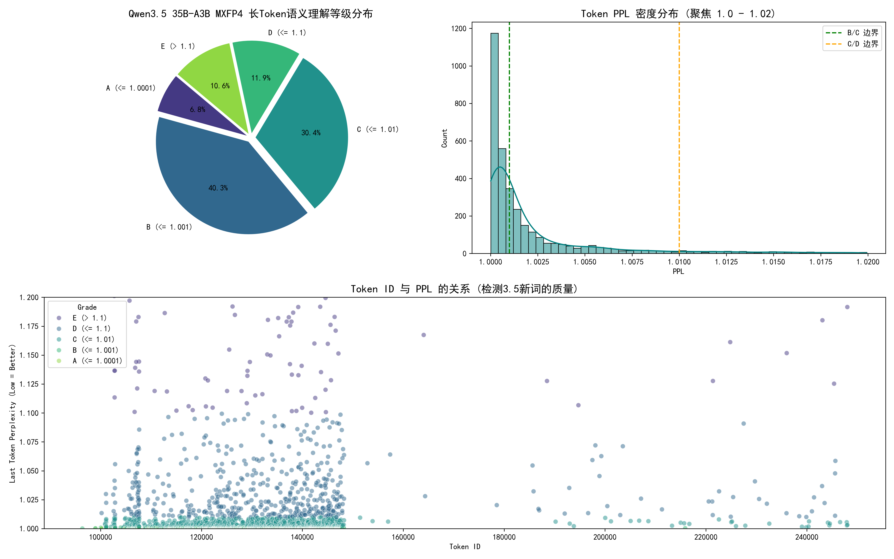

# 词表语义分析与修补工具 (Tokenizer Analyzer & Patcher)

本项目使用几种**我拍脑袋想出来但是有用**的算法，寻找Qwen3.5(以及其他模型)的 BPE 分词器中可能存在的欠训练 token  
找到之后，
- 通过**删除 merges 规则**的方式，强制分词器将“坏词”切分为更小、训练更充分的子 token
- 1.1版本不再修改 vocab 列表，保证模型仍然能在必要的时候“说出”这些 token
- 如果你不想模型说出这些 token ，可以使用 logits_bias，将这些 token 的概率设置为-inf

## 算法更新
- 1.0算法：**语义对齐检测**：计算【长 token】与其【通过参考模型词表切分的子 token】的 Embedding 之间的余弦相似度。
- 2.0算法：**拆字检测**：构造 prompt 让模型用 JSON 解释某个 token 内部包含哪些字。
- 2.1算法：**Last Token PPL**：在2.0的基础上，使用预期的JSON文本，计算模型预测JSON列表关闭符号`]`的困惑度
- 使用2.1算法重新处理了8000个长中文token，见 https://github.com/roj234/qwen35_tokenizer_utils/issues/2

## 这解决了什么问题？ (For What)
词表中有未被充分训练的词汇，Qwen3.5 在这些词汇上表现很差  
https://github.com/QwenLM/Qwen3.5/issues/33  

例如，你可以拿这些词去问 Qwen3.5，它基本上会开始胡编
- `开通天眼生意通银牌及以上会员`
- `认证成功后可编辑`
- `转贴或以其他方式`
- `加分后可超过约`

### Qwen 35B-A3B （原版）


### Qwen 35B-A3B （优化版v2）


（更多图片见Qwen的issue）  
你也可以查看并在本地测试[对抗样本](spring_ad.md)

### 这是新事吗？ (Reference)
否，太阳底下无新事：https://zhuanlan.zhihu.com/p/697685138

## 如果我是最终用户？ (Quick Start)
- 本项目中的`tokenizer_qwen_3.5_new.json`目前(v2.1)删除了1243个token

如果你不使用GGUF，直接下载项目中`tokenizer_patched.json`并替换Qwen3.5默认的`tokenizer.json`即可  
如果你用GGUF，克隆该项目并直接运行第3阶段  
如果你需要自定义删除的token，请看下面使用方法  

**如果这个项目有用，别忘了点一个免费的star**  
**如果这个项目遇到了问题，你也可以提交issue或者PR一起解决**

## 环境要求

### 1. 依赖库
安装以下 Python 库：
```bash
pip install numpy llama-cpp-python tqdm gguf
```
**请注意：llama-cpp-python必须使用 https://github.com/JamePeng/llama-cpp-python 的分支！**

### 2. 外部组件
*   **模型文件**：
    *   需要一个用于提取词表的源配置文件（`tokenizer.json`） 从 Qwen3.5 HF项目的 tokenizer.json 下载。
    *   需要一个目标 GGUF 模型进行修改。 我选择的是 Qwen3.5-35B-A3B // 因为我的电脑跑得动

---

## 使用方法

`main.py`有三个功能，如下：

### 1：生成预览词表
*   **命令**：`python main.py 1 --symbol-remove-type=[0, 1, 2]`
*   **逻辑**：从词表中提取长度大于等于4的中文token，0=不删除符号token，1=计算符号token的PPL，2=按白名单保留符号token
*   **产物**：`tokens_preview.csv`

### 1.5 选择一个或多个算法执行

`alg_1.0_embedding.py`是第一代算法

*   **命令**：`python alg_1.0_embedding.py -h`
*   需要一个用于提供参考词表的 GGUF 模型（REFERENCE_MODEL）。 我选择的是 Qwen3-4B-Instruct-2507 // 因为我手上正好有它
*   **逻辑**：对比“整体 Token”与“切分后序列”的余弦相似度。。
*   **产物**：`tokens_alignment.csv`

`alg_2.0_split_word.py`是第二代算法

*   **命令**：`python alg_2.0_split_word.py -h`
*   **逻辑**：构造 prompt 让模型用 JSON 解释某个 token 内部包含哪些字，并计算PPL。
*   **产物**：`black_hole.csv`

### 2：生成优化词表 (可以带入多个csv文件)
*   **命令**：`python main.py 2 --csv=black_hole.csv,block_hole_sym.csv,tokens_preview.csv --ppl-max=1.005`
*   **逻辑**：结合语义分数和过滤规则，删除 Token。
*   **产物**：新的 `tokenizer_patched.json`（删除后的合并规则）。

### 3：注入 GGUF 补丁
*   **命令**：`python main.py 3 --source=xxx.gguf --output=xxx-patched.gguf`
*   **逻辑**：读取 `tokenizer_patched.json`，将修改后的分词器规则写入 output。

`plot.py`用于画图  
画图还需要这些库
```bash
pip install matplotlib seaborn pandas
```


---

## 注意事项

**某些西班牙语、俄语、泰语字符得分很低**
- 其中，*确实*有一部分欠训练
- 另外一部分是因为 Qwen3 的分词器不太行，语义切的过于稀碎了
（比如假设泰文Apple，切成五个token \[a p p l e]，怎么看得懂?）

**随该项目发布的`tokenizer_patched.json`，我删除了很多符号token**
- 我不*确定*这对模型的代码能力有何影响，我只是*认为*会有提升
- 你可以在本地使用阶段2的命令，只提供`block_hole_cn4.csv`以生成不删除符号的词表