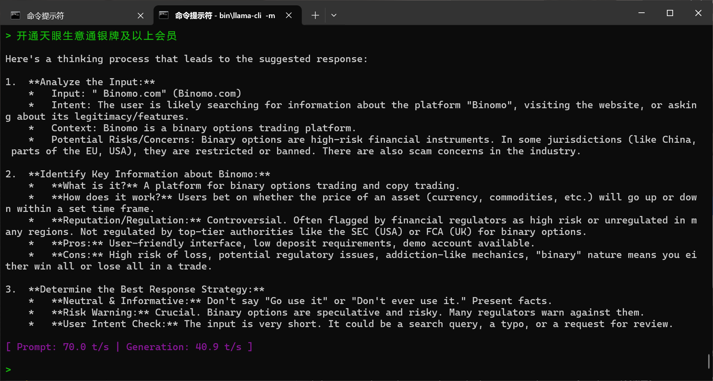
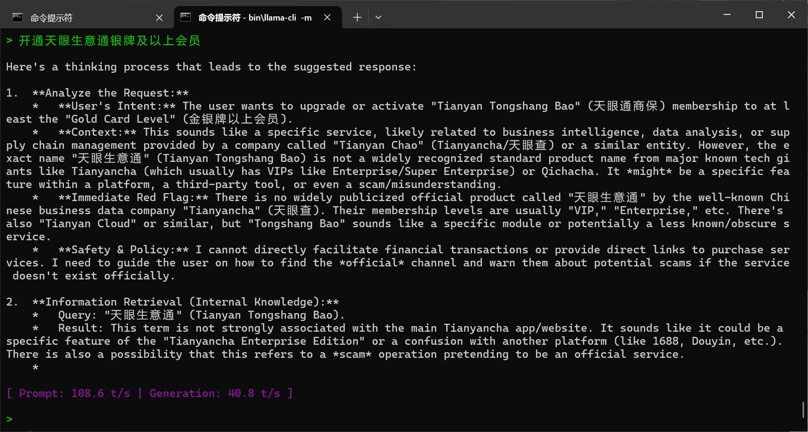

# 词表语义分析与修补工具 (Tokenizer Semantic Purge & Patch)

本脚本旨在通过语义对齐（Semantic Alignment）分析，检测并清理 GGUF 模型词表（Vocabulary）中质量较差或冗余的 Token。它通过对比“单个长 Token”与其“切分后的子 Token 序列”在嵌入空间（Embedding Space）中的相似度，识别出语义偏移较大的 Token，并将其替换为保留位（Reserved Tokens），最后生成修补后的 GGUF 文件。

## changelog
- 2/28更新：不再替换原有的 token，而是仅删除 merges 规则，这允许模型说出这些 tokens，只是我们提交的 message 不会被 tokenize 成这些 token
- 当然，你也可以使用 logits_bias[...] = -inf 的方式不让模型说出这些 tokens
- 但是，由于统计方法问题（我也许应该用 llama 的词表，而不是 qwen3 的词表），有一些低相似度的 token 确是模型理解的

## 主要功能

1.  **语义对齐检测**：利用 Embedding 模型计算长 Token 与其分词结果之间的余弦相似度。
2.  **词表清理**：自动筛选低相似度（如相似度 < 0.5）且符合特定规则（如特定语系、纯符号等）的 Token。
3.  **合并规则（Merges）修正**：在清理 Token 的同时更新 BPE 合并规则，防止无效合并。
4.  **GGUF 注入**：直接将修改后的词表和合并规则写回新的 GGUF 模型文件，无需重新训练。

## 这解决了什么问题？
词表中有未被充分训练的词汇，Qwen3.5 在这些词汇上表现很差  
https://github.com/QwenLM/Qwen3.5/issues/33  

例如，你可以拿这些词去问 Qwen3.5，它基本上会开始胡编
- `开通天眼生意通银牌及以上会员`
- `认证成功后可编辑`
- `转贴或以其他方式`
- `加分后可超过约`

Original version


After token dummied


（更多图片见issue，更多词组见`tokens_alignment.csv`搜索`CRITICAL`）

### 这是新事吗？
否，太阳底下无新事：https://zhuanlan.zhihu.com/p/697685138

## 如果我是最终用户？
如果你的显存足够，不需要用GGUF，那么下载项目中`tokenizer_qwen3.5_new.json`并替换Qwen3.5默认的`tokenizer.json`即可  
如果你用GGUF，克隆该项目并直接运行第三阶段（别忘了在脚本中修改模型路径！）  
**如果这个项目有用，别忘了点一个免费的star**  
**如果这个项目遇到了问题，你也可以提交issue或者PR一起解决**

## 环境要求

### 1. 依赖库
安装以下 Python 库：
```bash
pip install numpy pandas tqdm gguf
```
**请注意：llama-cpp-python必须使用 https://github.com/JamePeng/llama-cpp-python 的分支！**

### 2. 外部组件
*   **模型文件**：
    *   需要一个用于提取词表的源配置文件（`tokenizer_qwen3.5.json`） 从 Qwen3.5 HF项目的 tokenizer.json 重命名得到。
    *   需要一个用于提供参考词表的 GGUF 模型（REFERENCE_MODEL）。 我选择的是 Qwen3-4B-Instruct-2507 因为我手上正好有它而已
    *   需要一个目标 GGUF 模型进行修改。 我选择的是 Qwen3.5-35B-A3B 因为我的电脑还能跑得动

## 使用方法

脚本分为三个阶段运行，请按顺序执行：

### 第一阶段：生成语义对齐报告
分析词表中长度超过 4 个字符的 Token，计算其语义对齐得分，并导出到 CSV。

该阶段需要三个小时
```bash
python script.py 1
```
*   **输出**：`tokens_alignment.csv`
*   **逻辑**：如果一个 Token（如“人工智能”）的向量与其拆分后（如“人工”+“智能”）的向量相似度过低，则被标记为“BAD”或“CRITICAL”。

### 第二阶段：生成虚拟占位词表
根据第一阶段生成的报告，结合过滤规则（如保留中文、剔除泰语/俄语、处理特殊符号），生成新的 `tokenizer.json`。

该阶段需要一分钟
```bash
python script.py 2
```
*   **输入**：`tokens_alignment.csv`, `tokenizer_qwen3.5.json`
*   **输出**：`tokenizer_qwen3.5_new.json`
*   **逻辑**：将低质量 Token 替换为 `<|RESERVED_N|>`，并同步删除 `merges` 中的相关规则。

### 第三阶段：应用 GGUF 补丁
将处理好的新词表和合并规则注入到原有的 GGUF 模型文件中。

该阶段需要好几分钟
```bash
python script.py 3
```
*   **输入**：`tokenizer_qwen3.5_new.json`, `SOURCE_MODEL.gguf`
*   **输出**：`final_model.gguf`
*   **说明**：该过程会保留原模型的所有 Tensor 权重，仅修改元数据中的词表部分。
*   **替代方案（未实现）**：理论上因为是删除 token，我们可以尝试原位修改，并使用一些填充或者重复编码……这样就不用复制 GGUF 了

## 详细清理逻辑

脚本内置了 `is_removeable_token` 函数，用于判断哪些低得分 Token 应该被移除：
*   目前只移除相似度得分低的中文字符，不过LLM写的正则会把日文也杀掉

## 多语言注意事项

**某些西班牙语、俄语、泰语字符得分很低**
- 其中，*确实*有一部分欠训练
- 另外一部分是因为 Qwen3 的分词器不太行，语义切的过于稀碎了
（比如假设泰文Apple，切成五个token \[a p p l e]，怎么看得懂?）